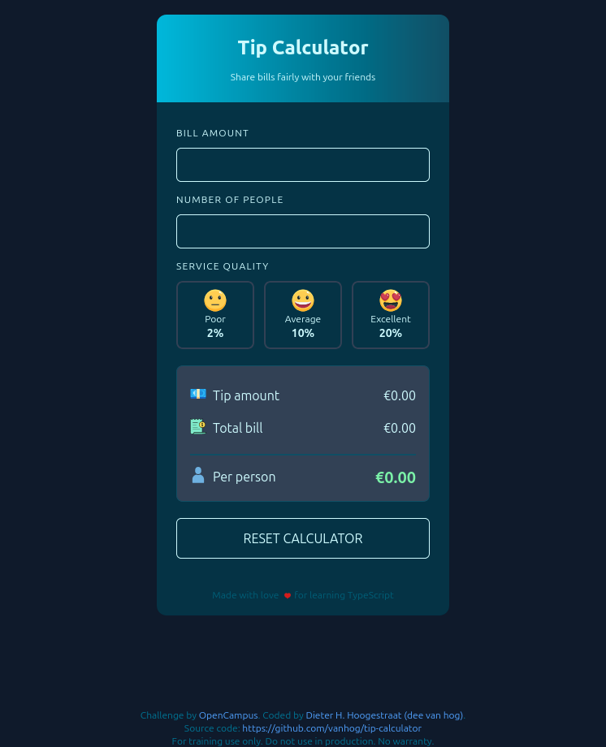

# Tip Calculator

**For training use only. Do not use in production. No warranty.**

This is a solution to the [OpenCampus WebDev Program 2025's ](https://edu.opencampus.sh/en) Tip calculator challenge.

## Table of contents

- [Screenshot](#screenshot)
- [Links](#links)
- [Built with](#built-with)
- [Author](#author)

## Screenshot

## Links

- Solution URL:[ https://github.com/vanhog/tip-calculator](https://github.com/vanhog/tip-calculator)
- Live Site URL: [https://vanhogs-ocwebdev-tipcalculator.netlify.app/](https://vanhogs-ocwebdev-tipcalculator.netlify.app/)

## Built with

- Semantic HTML5 markup
- CSS custom properties
- Tailwindcss
- Flexbox
- CSS Grid
- Mobile-first workflow

## Author

- Website - [Dieter H. Hoogestraat (dee van hog)](https://www.hoogestraat.com)
- Github - [@vanhog](https://github.com/vanhog)
